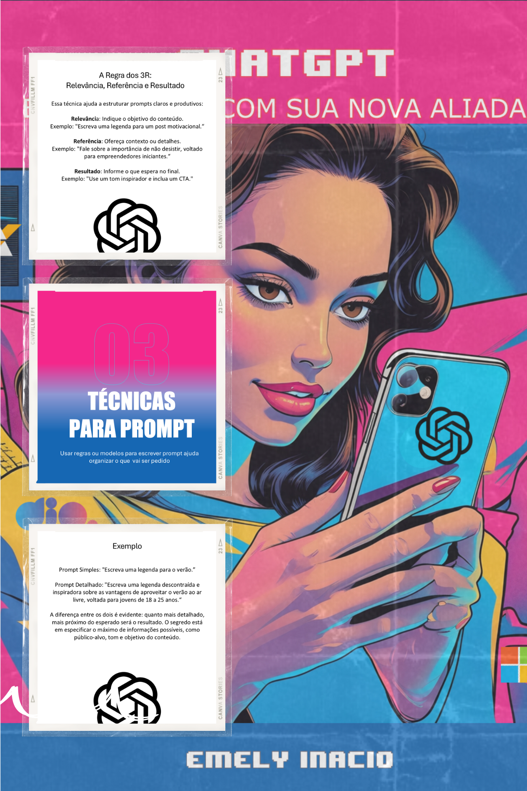

    

-------

# Projeto EBOOK Gerado por I.A.s

 > ℹ️ **NOTE:** Este repositório foi criado durante o Bootcamp promovido pela [Caixa](https://www.caixa.gov.br/Paginas/home-caixa.aspx), [DIO](https://dio.me) e [Microsoft](https://www.microsoft.com/pt-br/) como desafio proposto pelo professor [Felipe Aguiar](https://github.com/felipeAguiarCode) para conclusão do módulo.

Projeto com o objetivo de gerar um ebook digital com as facilidades das ferramentas de IA. Todos os prompts seguem abaixo.

<a href="https://github.com/Emely81/prompts-recipe-to-create-a-ebook/blob/main/output/Ebook%20DIO%20Caixa.pdf"> 📕Clique aqui para ler</a>

## 💻 Tecnologias utilizadas no projeto

- [ChatGPT](https://chat.openai.com/) 
- [Leonardo AI](https://app.leonardo.ai/)
- [PowerPoint](https://www.microsoft.com/en/microsoft-365/powerpoint)

## 🧠 Prompts

ChatGPT：

|   Ação   | Prompt                                                                                                                                                                                                                                                                         |
| :------: | ------------------------------------------------------------------------------------------------------------------------------------------------------------------------------------------------------------------------------------------------------------------------------ |
|  Título  | Crie um título para um ebook sobre o tema ChatGPT. O ebook é do nicho inteligência artificial e o subnicho é IA generativa. O título deve ser atraente, popular e curto, e tenha uma temática para público feminino, na faixa entre 18 e 50 anos, que está tendo o primeiro contato com IA Generativa e ChatGPT, me liste 6 variações de títulos.
| Conteúdo | Agora você é um escritor experiente e também profundo conhecedor de IA generativa, chatgpt e prompt. Faça um texto para ebook , com foco em IA Generativa, especialmente Chatgpt,  listando os principais modelos para escrever prompts assertivos com exemplos práticos para produção de conteúdo digital para Instagram. {REGRAS} Explique sempre de uma maneira simples. Deixe o texto curto e enxuto. Sempre traga exemplos de postagem em contextos reais, com situações do dia a dia. Sempre deixe um título sugestivo por tópico

Leonardo AI：

|  Ação  | Prompt                                                                                 |
| :----: | -------------------------------------------------------------------------------------- |
| Título | Generate a drawing of brunette woman lookin at her cell phone.  She's at home using your cell phone with ease. |

## ✨ Features

- Conteúdo gerado via ChatGPT
- Imagens geradas via Leonardo AI

## 📚 Materiais

- Imagens utilizadas em `assets`
- ebook gerado durante as aulas em `output`

## 🛠️ Instruções de execução

Foram seguidas as instruções dos prompts comforme repositório fork do expert [Felipe Aguiar](https://github.com/felipeAguiarCode)

## 👨‍💻 Expert

    
    
&nbsp&nbsp&nbspEmely Inacio 

   

---

⌨️ com 💜 por Emely Inacio
